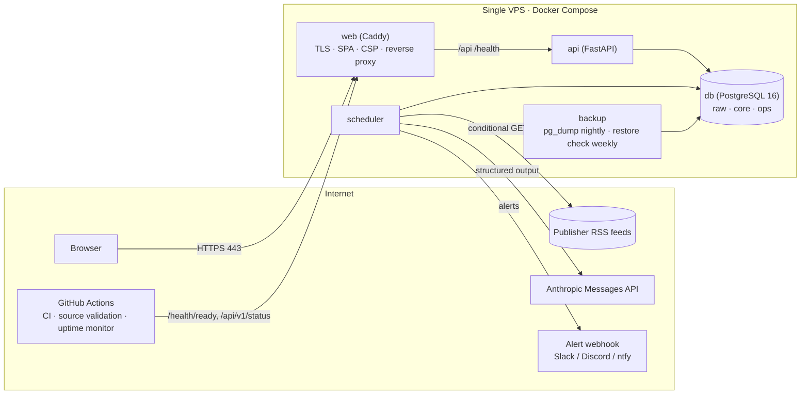
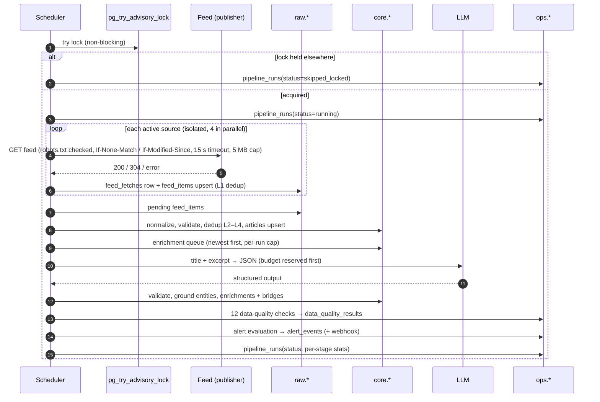
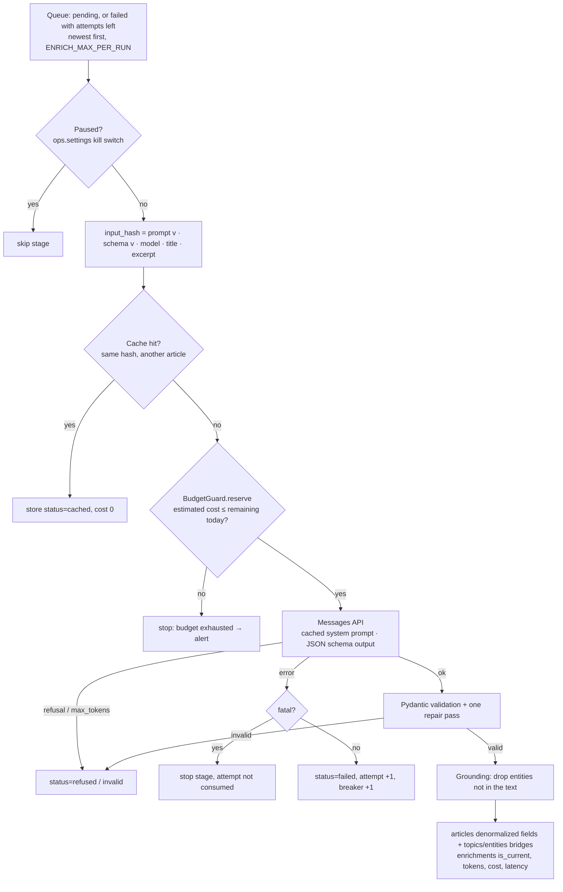
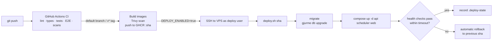

# Architecture

GJURMË is a **modular monolith**: one Python package (`gjurme`), one container image, one PostgreSQL database. The same image runs in three roles:

| Role | Command | What it does | Restart policy |
|---|---|---|---|
| `api` | `uvicorn gjurme.api.app:create_app --factory` | Serves `/api/v1/*`, `/health*`, `/metrics` | always |
| `scheduler` | `gjurme scheduler` | Runs the pipeline every 15 min, daily retention, admin run requests, heartbeat | always (stop grace 10 min, so a run finishes) |
| `migrate` | `gjurme db upgrade` | Applies Alembic migrations, then exits | once, before `api`/`scheduler` start |

The SPA is built into static files and served by **Caddy**, which also terminates TLS and reverse-proxies `/api` and `/health` to the API. Why this shape and not microservices, a queue or an orchestrator: [ADR-001](DECISIONS.md#adr-001-modular-monolith-one-image-two-processes), [ADR-004](DECISIONS.md#adr-004-no-queue-no-orchestrator).

## System



Network isolation (production compose): `db` sits only on an `internal` network with no route out. `scheduler` and `backup` also join an `egress` network (feeds, LLM API, webhook, off-site storage). `api` reaches the database and nothing else. Only Caddy publishes ports (80/443).

## Pipeline

One run = `ingest → process → enrich → quality → alerts`. Every stage reads its work from PostgreSQL and writes its result back, so any stage can be re-run alone (`gjurme ingest|process|enrich|quality`), and a crash leaves work for the next run instead of losing it.



Failure behaviour, stage by stage:

| Stage | Failure | Result |
|---|---|---|
| ingest | one feed times out / 5xx / is malformed | That source's fetch is recorded with the error; the others continue. After 20 consecutive failures (~5 h) the source is auto-disabled and an alert fires. Malformed XML that feedparser can recover is used and flagged. |
| process | one entry lacks a title/URL, has an unsafe URL, is too old | Rejected with a reason in `raw.feed_items.rejection_reason`; counted by the rejection-rate check. |
| enrich | timeout, 429, 5xx | SDK retries, then the attempt is stored as `failed`; the article is retried in later runs (max 3 attempts). |
| enrich | invalid JSON / schema violation | One repair pass, then stored as `invalid` with the raw response. |
| enrich | auth error, model not found | Fatal: the stage stops for this run without consuming the article's attempts; alert fires. |
| enrich | daily budget reached | No further calls are dispatched; the remaining articles stay `pending` for later runs (newest first); alert fires (deduplicated per day key for 6 h). |
| enrich | 5 consecutive failures | Circuit breaker opens; the stage stops; alert fires. |
| any | process crash | The lock dies with the connection; the next run marks the orphaned row `abandoned`. |

## AI enrichment flow



Details, including the prompt, schema, model choice and cost model, are in [AI_ENRICHMENT.md](AI_ENRICHMENT.md).

## Code layout

```
backend/src/gjurme/
  config.py            Settings from env vars; validate_for_env() refuses unsafe prod config
  logging_setup.py     JSON logs with run_id / request_id context
  taxonomy.py          19 topics, event types, entity types (controlled vocabulary)
  db/                  SQLAlchemy models, engine/session factory, reference data sync
  migrations/          Alembic (shipped in the package: gjurme:migrations)
  sources/             sources.yaml registry, sync, feed validator (autodiscovery)
  ingestion/           fetcher (robots, conditional GET, SSRF guard), feed parser,
                       normalizers, processor (validation + dedup L1–L4)
  enrichment/          prompt, schema, providers (Anthropic, Fake), budget, grounding,
                       pricing, service (queue, cache, persistence)
  analytics/queries.py every analytical query (parameterized SQL)
  quality/checks.py    12 data-quality checks
  alerts/engine.py     alert rules, dedup, webhook delivery
  pipeline/            runner, advisory locking, scheduler loop, retention
  api/                 FastAPI app, routers (public, ops/admin), schemas, security, metrics
  cli.py               `gjurme` command (Typer)
  demo.py              fictional demo data (refuses to run in staging/production)
frontend/src/
  api/                 typed client + React Query hooks
  pages/               Overview, Trends, Topics, Entities, Sources, Articles, About, Status
  components/          layout, filters, charts (Recharts), lists, states
  lib/                 URL-synced filters, formatting, safe links
deploy/                production compose, deploy/rollback script, backups, server bootstrap
```

## API

Base path `/api/v1`. OpenAPI UI at `/api/docs` (disable with `EXPOSE_DOCS=false`). Every analytics endpoint accepts `days` (1–366) **or** `from`/`to` (ISO dates, ≤ 366 days), plus `source` (repeatable slug). Responses are typed (Pydantic), errors use one envelope `{"error": {"code", "message", "details"}}`, and every response carries `X-Request-ID`.

### Public (rate-limited, cached for `API_CACHE_TTL_SECONDS`, `Cache-Control: public`)

| Method | Path | Returns |
|---|---|---|
| GET | `/analytics/overview` | Headline numbers: articles, unique stories, today vs yesterday, sources, enrichment share, sentiment mix, top topic, top entity |
| GET | `/analytics/volume` | Daily counts with 7-day moving average; `group_by=source\|topic` |
| GET | `/analytics/sentiment` | Daily sentiment mix and average; or per source/topic (`group_by`) |
| GET | `/analytics/sentiment/shift` | Topics whose average tone moved most, window vs previous window (`window` 3–30) |
| GET | `/analytics/trends/topics` | Topic momentum: growth = (cur − prev) / max(prev, 5) (`window` 3–30) |
| GET | `/analytics/trends/entities` | Entity spikes: z-score of last-24 h mentions vs 28-day baseline (`limit` ≤ 50) |
| GET | `/analytics/cooccurrence` | Entity pairs most often mentioned together (`limit` ≤ 100) |
| GET | `/topics` | All 19 topics with count, share, change and tone (zero-filled) |
| GET | `/topics/taxonomy` | The controlled vocabulary (slug, English/Albanian names, description) |
| GET | `/topics/{slug}` | Daily series, top entities and per-source counts for one topic |
| GET | `/entities` | Most-mentioned entities; `type`, `q` (search, ≥ 2 chars), `limit`, `offset` |
| GET | `/entities/{id}` | Mentions over time, co-mentions, topics, sources |
| GET | `/sources` | Per source: volume, original (non-duplicate) articles, per-day rate, tone mix, top topics, verification and fetch health |
| GET | `/articles` | Search/filter: `q`, `topic`, `entity`, `sentiment`, `sort`, `page`, `page_size` (≤ 100). Never returns the publisher excerpt. |
| GET | `/articles/{id}` | Article metadata, AI analysis, topics, entities, related coverage, link to the original |

### Operational

| Method | Path | Auth | Returns |
|---|---|---|---|
| GET | `/health` | — | Liveness |
| GET | `/health/ready` | — | Database reachable + migration revision; 503 otherwise |
| GET | `/api/v1/status` | — | Public freshness: `ok` / `degraded` (a source failing or last run partial) / `stale` (no successful run for `ALERT_STALE_PIPELINE_MINUTES`), last run, scheduler heartbeat, articles last 24 h, enrichment backlog, per-source health |
| GET | `/metrics` | internal network, or Bearer token | Prometheus metrics (HTTP + pipeline gauges read from the DB). Caddy answers 404 publicly. |

### Admin (`Authorization: Bearer $ADMIN_API_TOKEN`, separate rate-limit bucket)

| Method | Path | Purpose |
|---|---|---|
| GET | `/admin/runs`, `/admin/runs/{id}` | Run history and full per-stage statistics |
| POST | `/admin/pipeline/run` | Request a run (picked up by the scheduler within a minute; never runs inside the API) |
| GET | `/admin/costs` | LLM calls, tokens, cost per day and model; today's spend vs budget |
| POST | `/admin/enrichment/pause`, `/admin/enrichment/resume` | Kill switch for all LLM calls (no redeploy) |
| POST | `/admin/sources/{slug}/disable`, `/enable` | Stop or resume fetching a source |
| POST | `/admin/articles/{id}/hide`, `/unhide` | Takedown: removes the article from every public response |
| POST | `/admin/articles/{id}/reenrich` | Queue one article for re-enrichment |
| GET | `/admin/quality` | Latest result of every data-quality check |
| GET | `/admin/alerts` | Recent alerts, delivered and suppressed |
| GET | `/admin/failures` | Recent enrichment failures and rejected feed items |

## Request lifecycle (API)

1. Caddy: TLS, HSTS, strict CSP for the SPA, static files with immutable caching for hashed assets, reverse proxy with `X-Forwarded-For`.
2. Middleware: request id → rate limit (per client IP; token buckets `default` / `search` / `admin`) → security headers → timing metrics.
3. Router: validated query params → cache lookup (key = path + normalized query) → one `analytics/queries.py` function → typed response.
4. Exceptions become the error envelope; 5xx never leak internals and are logged with the request id.

## Deployment



Step-by-step instructions, secrets and costs: [DEPLOYMENT.md](DEPLOYMENT.md). Day-2 operations: [OPERATIONS.md](OPERATIONS.md).
