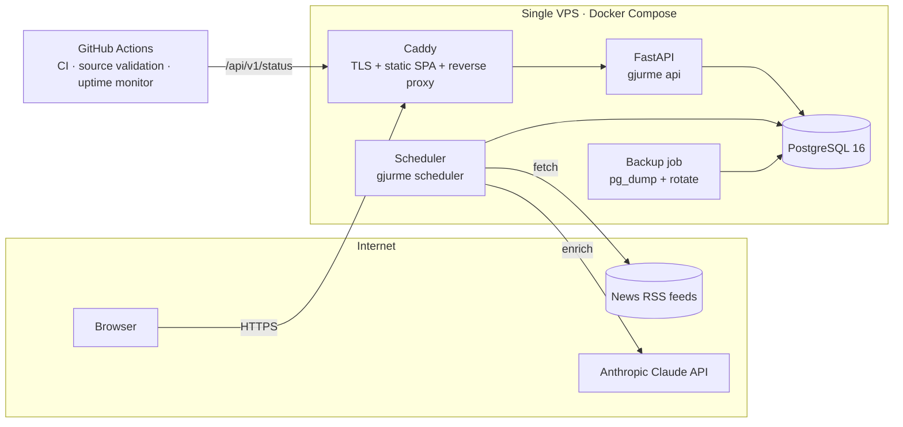
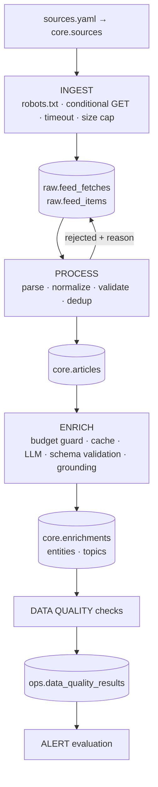

# GJURMË — Master Blueprint

> *Gjurmë* (Albanian): "trace, footprint". GJURMË traces what Albanian and Balkan media talk about, who is in the news, and how coverage shifts over time.

This document is the plan the codebase was built against. Architecture details, the data model and operations each have their own documents (see the [docs index](#13-documentation-map)). Anything here that did not survive implementation is corrected in [DECISIONS.md](DECISIONS.md).

---

## 0. Discovery results (Phase 0)

| Item | Finding |
|---|---|
| Workspace | Empty Git repository (`FlorentLatifi/Gjurm-`), no commits, no existing code, config, Docker or CI. Built from scratch. |
| Toolchain in build env | Python 3.11, Node 22, Docker 29 (daemon started manually), PostgreSQL 16 binaries (incl. `pg_trgm`, `unaccent`). |
| Network in build env | PyPI, npm and GitHub reachable. **Every news domain is blocked by the build container's egress policy** (HTTP 403 at the proxy, also for server-side fetch). |
| Credentials | No LLM API key, no cloud credentials, no domain. |

Consequences:

1. RSS URLs **cannot be verified from the build container**. Verification is therefore built into the product: `gjurme sources validate` (feed fetch + autodiscovery + field report), run by a GitHub Actions workflow on GitHub's runners, which have open egress. Sources stay marked `unverified` until that report confirms them.
2. The LLM integration is written against the official Anthropic Python SDK and tested against a local HTTP server that speaks the Messages API wire format. That exercises the real SDK path without a key. Live enrichment starts when `ANTHROPIC_API_KEY` is set.
3. Deployment is fully scripted, but the final `deploy` needs a server, a domain and GitHub secrets from the owner (listed in [DEPLOYMENT.md](DEPLOYMENT.md)).

---

## 1. Product requirements

### 1.1 Problem
Albanian-language news is fragmented across dozens of high-volume portals. Nobody can read everything, and there is no public tool that answers basic media-intelligence questions for this language space: *What is dominating coverage this week? Who is suddenly in the news? Does outlet A cover politics more negatively than outlet B?* English-speaking researchers, journalists and diplomats have even less access.

### 1.2 Users
| Persona | Need |
|---|---|
| Curious reader / citizen | "What's the news landscape today?" |
| Journalist / researcher / analyst | Trends, entity timelines, source comparison, exportable facts with links to the originals |
| International observer | English summaries and topic labels for Albanian-language coverage |
| Operator (owner) | Pipeline health, costs, source control, takedowns |

### 1.3 Scope levels

| Level | Contents |
|---|---|
| **MVP** | RSS → normalize → Postgres, dedup, LLM enrichment with validation + budget, basic analytics API. |
| **V1 (this mission)** | Everything in MVP + trend detection, public dashboard (overview, trends, topics, entities, sources, article explorer, methodology/legal pages), admin API, scheduler with overlap protection, data-quality checks, alerting, backups with restore verification, Docker, CI/CD, deployment scripts, docs. |
| **V2** | Batch-API enrichment (50% cheaper), story clustering with embeddings, entity resolution / alias learning, entity graph view, anomaly alerts to subscribers, multilingual (Serbian/Macedonian) sources, public dataset export. |

### 1.4 Non-goals (V1)
No user accounts, no full-text article republication, no scraping of article pages, no image hosting, no microservices, no Kubernetes, no message broker, no vector DB.

---

## 2. System architecture

**Shape: a modular monolith.** One Python package (`gjurme`) holds the pipeline, the analytics and the API. It ships as one container image that runs as two processes, `api` and `scheduler`. They share the data model and code, but they fail and scale independently. The pipeline is split into stages that each read and write Postgres, so each stage can be rerun on its own.

Why not microservices, Airflow or Kafka: there is one data source type, one datastore, and roughly 1,000 articles a day. A queue or an orchestrator would add a lot of operational surface and no capability we need. Postgres advisory locks cover mutual exclusion, and Postgres tables cover stage state. (ADR-001, ADR-004)

---

## 3. Data architecture

### 3.1 Layers (Postgres schemas)

| Schema | Contents | Mutability | Reprocessable from |
|---|---|---|---|
| `raw` | `feed_fetches` (one row per HTTP fetch), `feed_items` (one row per distinct feed entry, verbatim parsed payload) | Append-only; `payload` purged after retention window | Source feeds (refetch) |
| `core` | `sources`, `articles`, `topics`, `entities`, `article_topics`, `article_entities`, `enrichments` | Upserts, idempotent | `raw` (normalize), LLM (enrich) |
| `ops` | `pipeline_runs`, `data_quality_results`, `alert_events`, `settings` | Append / small updates | n/a |

- **raw → core** happens in the *process* stage. It picks `raw.feed_items` where `processed_at IS NULL`, so a crash mid-stage just leaves items for the next run.
- **core.articles → enrichments** happens in the *enrich* stage. It picks articles whose `enrichment_status` is `pending`, or `failed` with attempts left. Every attempt is stored.
- Changing the prompt or model bumps `PROMPT_VERSION`. `gjurme enrich-requeue --older-than-version X` queues old articles for re-enrichment, and history is kept. Analytics read only the enrichment marked `is_current`.

### 3.2 Grain of the main tables

| Table | Grain | Key | Notes |
|---|---|---|---|
| `raw.feed_items` | one entry per source, keyed by stable item key (guid, else canonical link) | `(source_id, item_key)` unique | first/last seen, processing outcome, rejection reason |
| `core.articles` | one published article (canonical URL) | `url_hash` unique | fact table; `published_at` UTC + `published_date` (Europe/Tirane) |
| `core.enrichments` | one LLM attempt for one article | id; partial unique `(article_id) WHERE is_current` | model, prompt version, tokens, cost, latency, raw JSON |
| `core.article_entities` | article × entity | `(article_id, entity_id)` | bridge |
| `core.article_topics` | article × topic | `(article_id, topic_id)` | `is_primary` flag |
| `core.entities` | real-world entity | `(type, normalized_key)` unique | person / organization / location |
| `core.topics` | fixed taxonomy node | slug | seeded, controlled vocabulary |

The ERD, DDL and sample SQL are in [DATA_MODEL.md](DATA_MODEL.md).

**No date dimension table.** Every date question is answered with `date_trunc` on an indexed `published_date` column and `generate_series` for gap filling. A `dim_date` would add joins and no attributes we use (no fiscal calendars, no holidays). (ADR-006)

---

## 4. Sources

Candidate list at planning time. **Outcome of validation:** Telegrafi, KOHA, Gazeta Express, Kallxo and Radio Evropa e Lirë are verified and enabled; Top Channel (HTTP 403) and Balkan Insight (robots.txt) are excluded ([SOURCES.md](SOURCES.md)):

| Source | Country | Language | Candidate feed | Why |
|---|---|---|---|---|
| Telegrafi | XK | sq | `https://telegrafi.com/feed/` | Highest-traffic Kosovo portal |
| KOHA | XK | sq | `https://www.koha.net/rss` + autodiscovery | Newspaper of record |
| Gazeta Express | XK | sq | `https://www.gazetaexpress.com/feed/` | Broad coverage |
| Kallxo | XK | sq | `https://kallxo.com/feed/` | Investigative / justice, BIRN |
| Radio Evropa e Lirë | XK/AL | sq | autodiscovery from `/rssfeeds` | Public-service standard (RFE/RL) |
| Top Channel | AL | sq | `https://top-channel.tv/feed/` | Albania coverage |
| Balkan Insight | Regional | en | `https://balkaninsight.com/feed/` | Regional English perspective |

Adding a source means adding a YAML entry to `backend/src/gjurme/sources/sources.yaml` and running `gjurme sources sync`. No code changes.

---

## 5. Legal / content-usage design

Legal claims are **not** made here. The design follows the safer technical option wherever terms are uncertain:

- Store **metadata only**: title, URL, source, timestamps, feed categories and author. The feed excerpt is kept **internally** as LLM input, is **never exposed** by the public API, and is purged after 90 days.
- Publish only **our own derived data**: topics, entities, sentiment, and a one-sentence English summary written by the model. Every article links back to its original, with the source named.
- No article-page scraping, no images, no full text.
- Polite fetching: identifying `User-Agent` with a contact URL, `robots.txt` checked for the feed path, conditional GET (`ETag` / `Last-Modified`), a minimum 15-minute interval, a response size cap.
- A takedown path: the contact on the About page, plus the admin endpoint `POST /api/v1/admin/articles/{id}/hide` and `sources disable`. Both are documented in [OPERATIONS.md](OPERATIONS.md).
- Privacy: no cookies, no analytics trackers, no user data stored. Rate-limit state is in memory only.

---

## 6. Pipeline

- **Isolation**: each source is fetched in its own `try` block, so one broken source is recorded and skipped. A source is auto-disabled after N consecutive failures (default 20, about 5 hours), and that raises an alert.
- **Idempotency**: `INSERT … ON CONFLICT` at every layer, keyed on deterministic hashes. Running the same job twice changes nothing.
- **Overlap protection**: `pg_try_advisory_lock` held for the duration of a run. A second scheduler, a manual CLI run or a cron double-fire logs `skipped_locked`. Crashed runs are detected (lock gone, status still `running`) and marked `abandoned`.

### Deduplication
| Layer | Level | Mechanism |
|---|---|---|
| L1 | MVP | Feed entry key `(source, sha256(guid or canonical link))`. A refetched entry updates `last_seen_at` only. |
| L2 | MVP | Canonical URL (lower-cased host, no fragment, tracking params removed, sorted query, no trailing slash) → `url_hash` unique. |
| L3 | MVP | Same source + normalized-title hash within ±48 h → treated as the same article (slug edits, republishing). |
| L4 | Advanced | Cross-source near-duplicates: trigram similarity of normalized titles ≥ 0.8 **and** only noise words differ, within 48 h → `duplicate_of_id` link (threshold calibrated on real headlines, ADR-008). Both rows are kept, because each outlet's coverage counts, and a "unique stories" metric is exposed. |
| L5 | Advanced | Enrichment cache: identical `(prompt_version, model, input_hash)` reuses the prior result at zero cost. |

---

## 7. AI enrichment

Detail: [AI_ENRICHMENT.md](AI_ENRICHMENT.md).

- **Provider**: Anthropic Claude via the official `anthropic` Python SDK (1.x). JSON-schema **structured outputs** (`output_config.format`), then **Pydantic validation**, then **grounding checks**.
- **Default model `claude-sonnet-5`** with thinking disabled: the task is extraction/classification, not reasoning. Configurable with `LLM_MODEL`. `claude-opus-5` suits the highest quality, `claude-haiku-4-5` the lowest cost.
- **Input**: title + feed excerpt (≤ 1,200 chars). Never full articles.
- **Output**: language, primary topic plus up to 3 secondary topics (controlled taxonomy), sentiment label and score, event type, English one-sentence summary, up to 12 entities (person/org/location), country codes, self-reported confidence.
- **Reliability**: SDK retries for 429/5xx/timeouts; our own attempt counter (max 3 per article); malformed or invalid output is stored with the error; `refusal` is non-retryable; a circuit breaker stops the stage after 5 consecutive failures; entities not grounded in the source text are dropped and counted.
- **Versioning**: `PROMPT_VERSION` and `SCHEMA_VERSION` are constants in code. Every enrichment row stores model, prompt version, schema version, tokens, cost, latency, attempt, and raw response.
- **Cost control**: a daily USD budget (hard stop), a per-run article cap, per-call cost estimated before sending, a kill switch in the DB (`ops.settings.enrichment_paused`) toggled from the admin API without a redeploy, a prompt-cached system prompt, and dedup plus the enrichment cache so nothing is paid for twice.

### Cost estimate (Sonnet 5 at $2 / $10 per MTok; cached system prompt ~1.4k tokens at 0.1×; ~350 input + ~300 output tokens per article)

| Articles/day | $/day | $/month |
|---|---|---|
| 100 | ≈ 0.39 | ≈ 12 |
| 500 | ≈ 1.95 | ≈ 59 |
| 1,000 | ≈ 3.9 | ≈ 117 |
| 10,000 | ≈ 39 | ≈ 1,170 |

The default `LLM_DAILY_BUDGET_USD=2.00` caps spend at about $60/month. Articles beyond the budget stay `pending` and are enriched on later days, newest first. Levers in order: prompt caching (on), dedup plus the enrichment cache (on), the Batch API at −50% (V2), and a cheaper model.

---

## 8. Analytics & trend detection

Each chart answers one stated question (see the dashboard spec in §10). The methods are transparent statistics:

| Signal | Method |
|---|---|
| Volume trend | Daily counts, 7-day trailing moving average |
| Topic momentum | Last 7 days vs. prior 7 days: `growth = (cur − prev) / max(prev, 5)`, reported only when `cur ≥ 5` |
| Entity spikes | Last-24 h mentions vs. 28-day daily baseline: `z = (x − μ) / max(σ, 1)`, flagged if `z ≥ 3` and `x ≥ 5` |
| Sentiment shift | Mean sentiment score of 7 days vs. prior 7 days, per topic / source / entity, with n shown |
| Co-occurrence | Entity pairs sharing articles in the window, ranked by count |
| Source profile | Topic mix (share of articles), sentiment distribution, volume, share of unique stories |

---

## 9. API

FastAPI, versioned under `/api/v1`, OpenAPI at `/api/docs`. Typed Pydantic responses; validated query params (date ranges ≤ 366 days, page size ≤ 100); consistent error envelope `{"error": {"code", "message", "details"}}`; per-IP token-bucket rate limiting (stricter for search and admin); in-process TTL cache plus `Cache-Control` for analytics; admin routes behind a Bearer token checked with constant-time compare. Endpoint list: [ARCHITECTURE.md](ARCHITECTURE.md#api).

## 10. Frontend

React + TypeScript + Vite, TanStack Query for fetching and caching, Recharts for charts, React Router. Pages:

| Page | Questions answered |
|---|---|
| Overview | How much was published today / this week? What is the top topic and the most-mentioned entity? What is the overall tone? What is trending right now? |
| Trends | Is coverage volume rising? Which topics are accelerating? Is tone shifting? |
| Topics | Which topics dominate? How is each one trending? Who is involved in it? |
| Entities | Who and what is most discussed? Who is spiking? Who appears together? |
| Sources | How do outlets differ in volume, topic mix and tone? |
| Articles | Find articles by keyword, source, topic, entity, sentiment and date; open the original. |
| About / Methodology | How the numbers are made, their limitations, attribution, takedown contact. |
| Status | Pipeline freshness and source health. |

Quality bar: responsive, keyboard accessible, semantic landmarks, AA contrast, charts with text summaries and table fallbacks, skeleton loading, explicit error and empty states, dark mode.

## 11. Operations

| Concern | Design |
|---|---|
| Scheduling | `gjurme scheduler`, an in-container loop run every 15 minutes, with an advisory lock and DB-recorded runs. GitHub Actions cron was evaluated and rejected as the primary scheduler: it runs best-effort (commonly delayed), it is disabled after repo inactivity, and it would need the DB exposed to the internet. GHA is used for **external** monitoring instead. (ADR-005) |
| Observability | JSON structured logs with `run_id`; `ops.pipeline_runs` with per-stage stats; Prometheus `/metrics` (internal only); `/api/v1/status` public freshness endpoint; admin cost and run endpoints. |
| Alerting | Webhook (Slack/Discord-compatible) on: pipeline failed, all sources down, source auto-disabled, budget exhausted, enrichment circuit open, abnormal volume (z-score vs. 14-day baseline), no successful run in 2 h. Deduplicated per alert key (6 h). An external GitHub Actions monitor covers "whole server is down". |
| Backups | Nightly `pg_dump -Fc`, 7 daily + 4 weekly kept, optional off-site copy via rclone, weekly automated **restore verification** into a scratch DB. |
| Environments | `GJURME_ENV` = development / test / staging / production. Production refuses demo seeding, destructive commands, fake LLM providers, weak admin tokens and wildcard CORS. |
| Deployment | Single VPS + Docker Compose + Caddy (automatic HTTPS). Images built by CI and pushed to GHCR, tagged by commit SHA; deploy = `docker compose pull && up -d`, then health check, then automatic rollback to the previous SHA on failure. |

### Hosting decision (prices checked September 2026, re-verify before purchase)
| Option | Monthly | Verdict |
|---|---|---|
| 1 VPS (2 vCPU / 2–4 GB), e.g. DigitalOcean 2 GB ≈ $12, Hetzner CPX12 ≈ €12 | ~$12–15 | **Chosen.** Cheapest, full control, runs the scheduler natively, best DevOps learning value. |
| Render (web $7 + worker $7 + Postgres ≥ $6) | ~$20–40+ | Good DX, costs more per service, cron billed separately. |
| Fly.io (machines + Managed Postgres from $38) | ~$45+ | Managed Postgres pricing is too high for this project. |
| GitHub Actions as scheduler + serverless DB | variable | Rejected: best-effort cron, DB exposed publicly. |

Total expected run cost: VPS about $12–15, LLM capped at about $60 (at a $2/day budget), domain about $1, off-site backup storage about $0–1, so **about $75/month at most, and lower at a smaller budget**.

---

## 12. Roadmap and Definition of Done

| Phase | Objective | Main files | Tests / verification | Done when |
|---|---|---|---|---|
| 0 Discovery | Understand workspace and constraints | — | tool probes | constraints documented (§0) |
| 1 Architecture | Blueprint + ADRs | `docs/` | review | this doc + DECISIONS.md |
| 2 Sources | Registry + validator | `sources/`, `cli.py`, `.github/workflows/sources.yml` | unit tests on autodiscovery / report | validator runs in GHA; results in SOURCES.md |
| 3 Database | Schema + migrations | `db/models.py`, `migrations/` | migration up/down test on real PG | `alembic upgrade head` clean from zero |
| 4 Ingestion | Robust fetch | `ingestion/fetcher.py` | timeout / malformed / 304 / robots tests | one bad source doesn't stop others |
| 5 Cleaning | Normalizers + validation | `ingestion/normalize.py` | Unicode (ë, ç), dates, URLs | rejects recorded with reason |
| 6 Dedup | L1–L4 | `ingestion/processor.py` | double-run idempotency test | 2nd run creates 0 rows |
| 7 AI | Enrichment | `enrichment/` | schema, malformed JSON, timeout, budget, SDK wire test | failures stored, budget enforced |
| 8 Analytics | Queries + trends | `analytics/` | fixture-based numeric tests | numbers match hand calculations |
| 9 API | FastAPI | `api/` | endpoint + validation + auth + rate-limit tests | OpenAPI complete |
| 10 Frontend | Dashboard | `frontend/` | vitest + Playwright e2e | all pages have loading / empty / error states |
| 11 Testing | Suite | `tests/` | CI | green in CI |
| 12 Docker | Images + compose | `Dockerfile`s, `compose*.yml` | full stack up locally | healthchecks green |
| 13 CI/CD | Workflows | `.github/workflows/` | runs on push | CI green on GitHub |
| 14 Deployment | Scripts | `deploy/` | local prod-compose rehearsal | documented, blocked only on owner credentials |
| 15 Monitoring | Metrics / alerts | `ops/`, `alerts/` | alert unit tests | alerts fire in tests |
| 16 Security | Hardening | headers, CORS, auth, scanning | tests + scanners | SECURITY.md checklist |
| 17 Data quality | DQ checks | `quality/` | tests | results persisted per run |
| 18 Validation | E2E smoke | compose stack | Playwright + API smoke | all green |
| 19 Documentation | Docs | `README.md`, `docs/` | review | complete |
| 20 Launch | Checklist | `docs/LAUNCH_CHECKLIST.md` | — | only owner actions remain |

## 13. Documentation map
- [ARCHITECTURE.md](ARCHITECTURE.md) — components, flows, API surface
- [DATA_MODEL.md](DATA_MODEL.md) — ERD, DDL, analytical SQL
- [AI_ENRICHMENT.md](AI_ENRICHMENT.md) — prompt, schema, reliability, cost
- [SOURCES.md](SOURCES.md) — source registry and validation results
- [DEPLOYMENT.md](DEPLOYMENT.md), [OPERATIONS.md](OPERATIONS.md) — run it, fix it
- [SECURITY.md](SECURITY.md), [TESTING.md](TESTING.md), [DECISIONS.md](DECISIONS.md)
- [LAUNCH_CHECKLIST.md](LAUNCH_CHECKLIST.md), [PORTFOLIO.md](PORTFOLIO.md)
