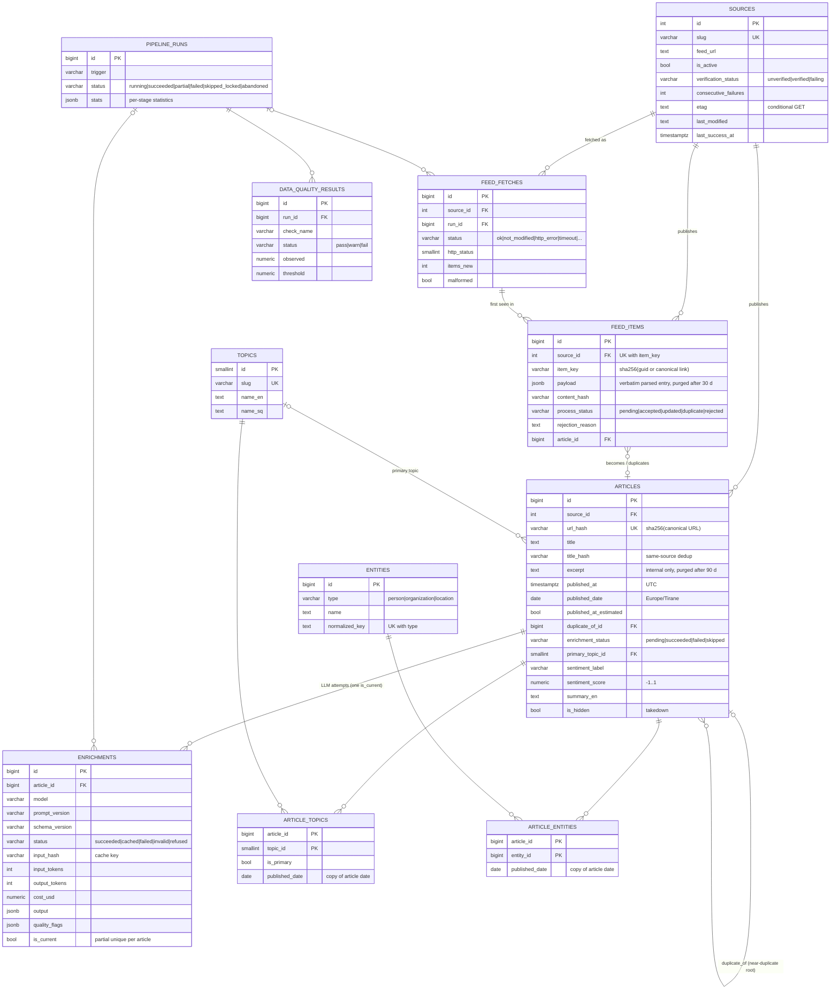

# Data model

GJURMË stores everything in one PostgreSQL 16 database with three schemas. Each schema is a layer with its own mutability rules:

| Schema | Layer | Tables | Rules |
|---|---|---|---|
| `raw` | Landing / staging | `feed_fetches`, `feed_items` | Append-mostly. The verbatim parsed feed entry is kept so the curated layer can be rebuilt without refetching. Payloads are purged after 30 days. |
| `core` | Curated / analytical | `sources`, `articles`, `topics`, `entities`, `article_topics`, `article_entities`, `enrichments` | Idempotent upserts keyed on deterministic hashes. `articles` is the fact table. |
| `ops` | Operations | `pipeline_runs`, `data_quality_results`, `alert_events`, `settings`, `alembic_version` | Run history, check results, alert log, runtime switches (kill switch, run requests, heartbeat). |

The schema is defined by SQLAlchemy models (`backend/src/gjurme/db/models.py`) and created **only** by Alembic migrations (`backend/src/gjurme/migrations/versions/`). CI runs `upgrade → downgrade → upgrade` on an empty database and fails if the models and the migrations drift (`tests/integration/test_migrations_demo.py`).

## ERD



`ops.alert_events` (alert log incl. suppressed duplicates) and `ops.settings` (key → JSON value) have no foreign keys.

## Grain and keys

| Table | One row is | Natural key (enforced) | Why |
|---|---|---|---|
| `raw.feed_fetches` | one HTTP request for one feed | — | Fetch history: status, latency, bytes, 304s. Source health comes from here. |
| `raw.feed_items` | one distinct entry of one feed | `UNIQUE (source_id, item_key)` | **Dedup L1.** A refetched entry only bumps `last_seen_at`; a changed one is re-processed. |
| `core.articles` | one published article | `UNIQUE (url_hash)` | **Dedup L2** (canonical URL). L3/L4 are enforced by the processor (below). |
| `core.enrichments` | one LLM attempt or cache hit | partial `UNIQUE (article_id) WHERE is_current` | Full history. Analytics read the denormalized copy on `articles`. |
| `core.entities` | one real-world entity | `UNIQUE (type, normalized_key)` | `normalized_key` is lower-cased, accent-folded and whitespace-collapsed, so "Kurti" and "KURTI" merge but a person and a place with the same name do not. |
| `core.article_entities` | article × entity | `PK (article_id, entity_id)` | Bridge. |
| `core.article_topics` | article × topic | `PK (article_id, topic_id)` | Bridge. `is_primary` marks the primary topic. |

**Enumerations are `text` with CHECK constraints, not PostgreSQL ENUM types.** Adding a value to a CHECK constraint is one transactional migration, while `ALTER TYPE … ADD VALUE` cannot run inside a transaction on older servers and is awkward to roll back ([ADR-009](DECISIONS.md#adr-009-text--check-constraints-instead-of-enum-types)).

**Dates.** `published_at` is stored in UTC. `published_date` is the calendar date in `Europe/Tirane`, the audience's time zone, computed once at ingestion so "today" in the dashboard means today in Prishtina and Tirana. When a feed has no usable date, or a date in the future or implausibly old, the first-seen time is used and `published_at_estimated = true`. A data-quality check watches that rate.

**Bridge dates (migration 0002).** `article_entities` and `article_topics` carry a copy of the article's `published_date`, indexed as `(published_date, entity_id|topic_id) INCLUDE (article_id)`. Without it, every windowed entity query scanned the bridge's whole history (measured: [TESTING.md](TESTING.md#performance)). Two triggers keep the copy correct: a `BEFORE INSERT` trigger fills it for writers that omit it (the previous release, during a rolling deploy), and an `AFTER UPDATE OF published_date` trigger on `articles` propagates corrections. The copy therefore cannot drift, and the test suite checks both triggers.

## Deduplication and where it lives

| Layer | Rule | Enforced by |
|---|---|---|
| L1 | Same feed entry: `(source, sha256(guid or canonical link))` | `raw.feed_items` unique key; `ON CONFLICT` |
| L2 | Same canonical URL (lower-case host, no fragment, tracking parameters removed, sorted query, no trailing slash) | `core.articles.url_hash` unique key |
| L3 | Same source, same normalized-title hash, within ±48 h (slug edits, republication) | processor, `ix_articles_source_title_hash` |
| L4 | Cross-source near-duplicate: trigram similarity ≥ 0.8 **and** the words that differ are only noise tokens (±48 h) | processor, `ix_articles_title_trgm` (GIN); sets `duplicate_of_id`, both rows kept |
| L5 | Same enrichment input (`prompt_version`, `schema_version`, model, title, excerpt) | `core.enrichments` cache lookup; zero cost |

L4 keeps both rows on purpose: each outlet's coverage is a fact about that outlet. "Unique stories" collapses them (`count(DISTINCT coalesce(duplicate_of_id, id))`). The threshold was calibrated on real headlines ([ADR-008](DECISIONS.md#adr-008-l4-near-duplicate-rule-calibrated-on-real-headlines)).

## Key DDL

Abridged from `pg_dump --schema-only` of a database at head (full DDL: the migrations).

```sql
CREATE TABLE core.articles (
    id                     bigint GENERATED BY DEFAULT AS IDENTITY PRIMARY KEY,
    source_id              integer NOT NULL REFERENCES core.sources(id),
    url                    text NOT NULL,
    canonical_url          text NOT NULL,
    url_hash               varchar(64) NOT NULL CONSTRAINT uq_articles_url_hash UNIQUE,
    guid                   text,
    title                  text NOT NULL,
    title_normalized       text NOT NULL,
    title_hash             varchar(64) NOT NULL,
    excerpt                text,                -- LLM input only; never returned by the public API
    author                 text,
    feed_categories        text[] NOT NULL DEFAULT '{}',
    language               varchar(8) NOT NULL,
    published_at           timestamptz NOT NULL,
    published_date         date NOT NULL,       -- Europe/Tirane calendar date
    published_at_estimated boolean NOT NULL DEFAULT false,
    content_hash           varchar(64) NOT NULL,
    duplicate_of_id        bigint REFERENCES core.articles(id) ON DELETE SET NULL,
    enrichment_status      varchar(16) NOT NULL DEFAULT 'pending'
        CONSTRAINT ck_articles_enrichment_status
        CHECK (enrichment_status IN ('pending', 'succeeded', 'failed', 'skipped')),
    enrichment_attempts    smallint NOT NULL DEFAULT 0,
    enriched_at            timestamptz,
    primary_topic_id       smallint REFERENCES core.topics(id),
    sentiment_label        varchar(16) CONSTRAINT ck_articles_sentiment_label
        CHECK (sentiment_label IS NULL OR sentiment_label IN ('negative', 'neutral', 'positive')),
    sentiment_score        numeric(4, 3) CONSTRAINT ck_articles_sentiment_score
        CHECK (sentiment_score IS NULL OR sentiment_score BETWEEN -1 AND 1),
    event_type             varchar(32),
    detected_language      varchar(8),
    countries              text[] NOT NULL DEFAULT '{}',
    summary_en             text,
    enrichment_confidence  numeric(4, 3),
    is_hidden              boolean NOT NULL DEFAULT false,   -- takedown
    hidden_reason          text,
    ingested_at            timestamptz NOT NULL DEFAULT now(),
    updated_at             timestamptz NOT NULL DEFAULT now()
);
CREATE INDEX ix_articles_published_date       ON core.articles (published_date);
CREATE INDEX ix_articles_published_at         ON core.articles (published_at DESC);
CREATE INDEX ix_articles_source_published     ON core.articles (source_id, published_at DESC);
CREATE INDEX ix_articles_primary_topic_date   ON core.articles (primary_topic_id, published_date);
CREATE INDEX ix_articles_source_title_hash    ON core.articles (source_id, title_hash);
CREATE INDEX ix_articles_duplicate_of         ON core.articles (duplicate_of_id);
CREATE INDEX ix_articles_title_trgm           ON core.articles USING gin (title_normalized gin_trgm_ops);
CREATE INDEX ix_articles_enrichment_queue     ON core.articles (enrichment_status, published_at DESC)
    WHERE enrichment_status IN ('pending', 'failed');

CREATE TABLE core.article_entities (
    article_id     bigint NOT NULL REFERENCES core.articles(id) ON DELETE CASCADE,
    entity_id      bigint NOT NULL REFERENCES core.entities(id) ON DELETE CASCADE,
    published_date date NOT NULL,              -- copy of articles.published_date (0002)
    PRIMARY KEY (article_id, entity_id)
);
CREATE INDEX ix_article_entities_entity_article ON core.article_entities (entity_id, article_id);
CREATE INDEX ix_article_entities_date_entity    ON core.article_entities (published_date, entity_id)
    INCLUDE (article_id);

CREATE TABLE core.enrichments (
    id                 bigint GENERATED BY DEFAULT AS IDENTITY PRIMARY KEY,
    article_id         bigint NOT NULL REFERENCES core.articles(id) ON DELETE CASCADE,
    run_id             bigint REFERENCES ops.pipeline_runs(id) ON DELETE SET NULL,
    provider           varchar(32) NOT NULL,
    model              varchar(64) NOT NULL,
    prompt_version     varchar(32) NOT NULL,
    schema_version     varchar(32) NOT NULL,
    status             varchar(16) NOT NULL CONSTRAINT ck_enrichments_status
        CHECK (status IN ('succeeded', 'cached', 'failed', 'invalid', 'refused')),
    attempt            smallint NOT NULL,
    input_hash         varchar(64) NOT NULL,
    input_tokens       integer NOT NULL DEFAULT 0,
    output_tokens      integer NOT NULL DEFAULT 0,
    cache_read_tokens  integer NOT NULL DEFAULT 0,
    cache_write_tokens integer NOT NULL DEFAULT 0,
    cost_usd           numeric(12, 6) NOT NULL DEFAULT 0,
    latency_ms         integer,
    request_id         text,
    output             jsonb,                  -- validated structured output
    raw_response       text,                   -- kept for failures; purged after 90 days
    error              text,
    quality_flags      jsonb,                  -- e.g. entities dropped by grounding
    is_current         boolean NOT NULL DEFAULT false,
    created_at         timestamptz NOT NULL DEFAULT now()
);
CREATE UNIQUE INDEX uq_enrichments_current_per_article ON core.enrichments (article_id) WHERE is_current;
CREATE INDEX ix_enrichments_cache_lookup ON core.enrichments (input_hash, prompt_version, model)
    WHERE status IN ('succeeded', 'cached');
```

The exact column types, defaults and constraints are those in `20260924_0001_initial_schema.py` and `20260924_0002_bridge_published_date.py`. The block above is for reading, not for executing.

## Sample analytical SQL

All of these run against the current schema (checked on the 365k-article benchmark database). The API's versions live in `backend/src/gjurme/analytics/queries.py`.

```sql
-- 1. Daily volume with a 7-day trailing moving average (gap-filled)
WITH days AS (
  SELECT d::date AS day FROM generate_series(current_date - 29, current_date, interval '1 day') d),
counts AS (
  SELECT published_date AS day, count(*) AS n
  FROM core.articles WHERE NOT is_hidden AND published_date >= current_date - 35
  GROUP BY 1)
SELECT days.day, coalesce(c.n, 0) AS articles,
       round(avg(coalesce(c.n, 0)) OVER (ORDER BY days.day ROWS 6 PRECEDING), 1) AS ma7
FROM days LEFT JOIN counts c USING (day) ORDER BY days.day DESC LIMIT 3;

-- 2. Topic momentum: last 7 days vs the 7 before, damped growth
SELECT t.slug,
       count(*) FILTER (WHERE a.published_date > current_date - 7) AS cur,
       count(*) FILTER (WHERE a.published_date <= current_date - 7) AS prev,
       round((count(*) FILTER (WHERE a.published_date > current_date - 7)
            - count(*) FILTER (WHERE a.published_date <= current_date - 7))::numeric
            / greatest(count(*) FILTER (WHERE a.published_date <= current_date - 7), 5), 2) AS growth
FROM core.articles a JOIN core.topics t ON t.id = a.primary_topic_id
WHERE NOT a.is_hidden AND a.published_date > current_date - 14
GROUP BY t.slug ORDER BY growth DESC LIMIT 3;

-- 3. Most-mentioned people in the last 30 days (bridge date index range scan)
SELECT e.name, count(*) AS mentions, count(DISTINCT a.source_id) AS sources
FROM core.article_entities ae
JOIN core.articles a ON a.id = ae.article_id AND NOT a.is_hidden
JOIN core.entities e ON e.id = ae.entity_id AND e.type = 'person'
WHERE ae.published_date BETWEEN current_date - 29 AND current_date
GROUP BY e.name ORDER BY mentions DESC LIMIT 3;

-- 4. Source profile: share of each outlet's articles per topic (top topic per source)
SELECT DISTINCT ON (s.slug) s.slug, t.slug AS topic,
       round(count(*)::numeric / sum(count(*)) OVER (PARTITION BY s.slug), 3) AS share
FROM core.articles a JOIN core.sources s ON s.id = a.source_id
JOIN core.topics t ON t.id = a.primary_topic_id
WHERE NOT a.is_hidden AND a.published_date > current_date - 30
GROUP BY s.slug, t.slug ORDER BY s.slug, count(*) DESC LIMIT 3;

-- 5. Unique stories vs articles (cross-outlet near-duplicates collapse onto their root)
SELECT count(*) AS articles, count(DISTINCT coalesce(duplicate_of_id, id)) AS unique_stories
FROM core.articles WHERE NOT is_hidden AND published_date > current_date - 7;

-- 6. LLM spend per day and model, with cache effectiveness
SELECT created_at::date AS day, model, count(*) AS calls,
       count(*) FILTER (WHERE status = 'cached') AS cache_hits,
       sum(input_tokens) AS input_tokens, sum(cache_read_tokens) AS cache_read_tokens,
       sum(output_tokens) AS output_tokens, round(sum(cost_usd), 4) AS usd
FROM core.enrichments WHERE created_at > now() - interval '7 days'
GROUP BY 1, 2 ORDER BY 1 DESC;

-- 7. Lineage: from a dashboard number back to the raw feed entry and the LLM attempt
SELECT a.id, a.title, s.slug, fi.item_key, fi.first_seen_at, en.model, en.prompt_version,
       en.cost_usd
FROM core.articles a JOIN core.sources s ON s.id = a.source_id
LEFT JOIN raw.feed_items fi ON fi.article_id = a.id
LEFT JOIN core.enrichments en ON en.article_id = a.id AND en.is_current
ORDER BY a.id LIMIT 2;
```

## Retention

Applied daily by the scheduler (`gjurme retention --no-dry-run` does the same by hand; the default is a dry run that only counts).

| Data | Kept | Then | Why |
|---|---|---|---|
| `raw.feed_items.payload` (verbatim feed entry) | 30 days (`RETENTION_RAW_PAYLOAD_DAYS`) after processing | set to NULL; the row, hashes and outcome stay | Reprocessing window; the row keeps dedup working |
| `core.articles.excerpt` | 90 days (`RETENTION_EXCERPT_DAYS`) once enriched or skipped | set to NULL | Publisher text is only needed as LLM input |
| `core.enrichments.raw_response` | 90 days | set to NULL | Debugging failed calls |
| `raw.feed_fetches` | 90 days | deleted | Source-health history |
| `ops.pipeline_runs`, `ops.alert_events` | 180 days | deleted | Operational history |
| Articles, enrichments (structured output), entities, topics | indefinitely | — | They are the product: metadata and derived data only |

Takedown is not retention: `POST /api/v1/admin/articles/{id}/hide` sets `is_hidden`, and every public query filters on it immediately ([OPERATIONS.md](OPERATIONS.md#takedown-request)).

## Migrations policy

- One linear Alembic history, shipped inside the package (`gjurme:migrations`) so the production image can migrate itself (`gjurme db upgrade`). A PostgreSQL advisory lock serializes concurrent migrators.
- **Expand / contract.** A release may only add things the previous release tolerates (new nullable columns, new tables, new indexes, triggers that fill new columns). Removing or renaming happens in a later release, once no running code uses the old shape. This is what lets `deploy.sh` roll the application back without touching the database. Migration 0002 is an example: the new column is filled by a trigger for the old writer.
- `gjurme db check` exits non-zero if the database is not at head. The API's `/health/ready` reports the current revision.
